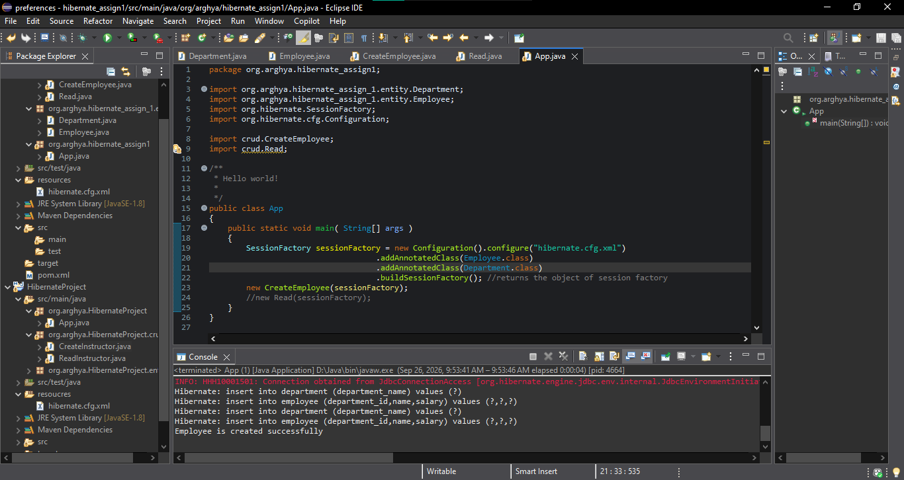
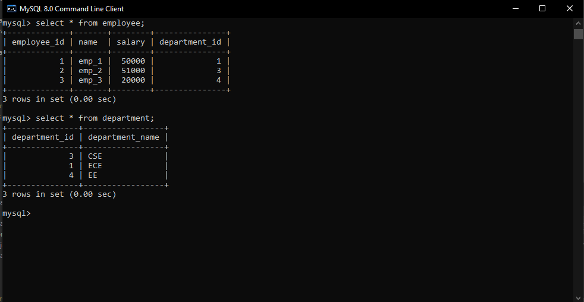
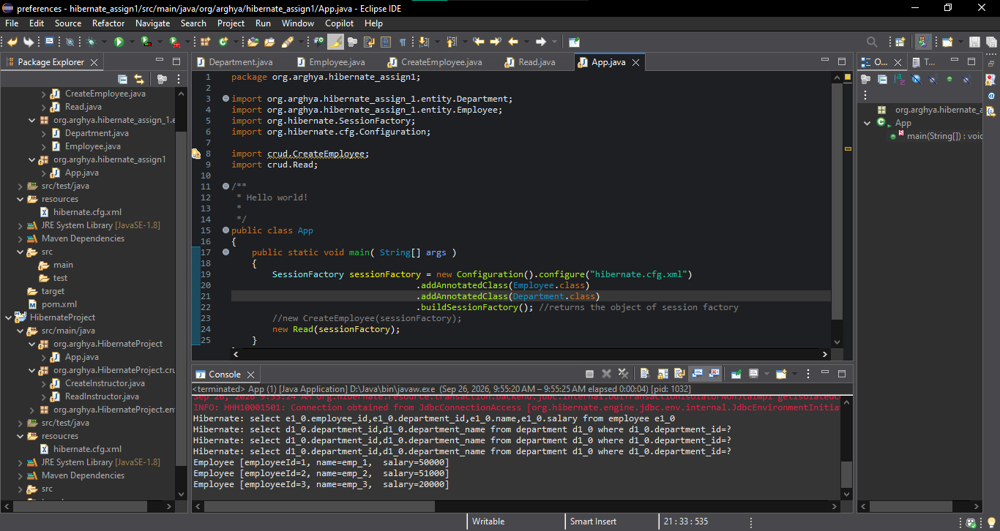

# Hibernate Assignment 1

A simple Java Hibernate project demonstrating how to **insert new data into a MySQL database and read the stored data using Hibernate**.

## Technologies Used

- Java
- Hibernate ORM
- MySQL
- Maven
- Eclipse IDE

## Project Description

This project demonstrates basic database operations using Hibernate.

The project performs two main operations:

1. **Create** – Inserts new data into the MySQL database using Hibernate.
2. **Read** – Retrieves the stored data from the database using Hibernate.

## Operations

### 1. Insert Data

The `create` program creates a new Java object and saves it into the MySQL database using Hibernate.

### 2. MySQL Database Output

The inserted data can be verified in the MySQL database.

### 3. Read Data

The `read` program retrieves the stored data from the MySQL database using Hibernate and displays it in the console.

